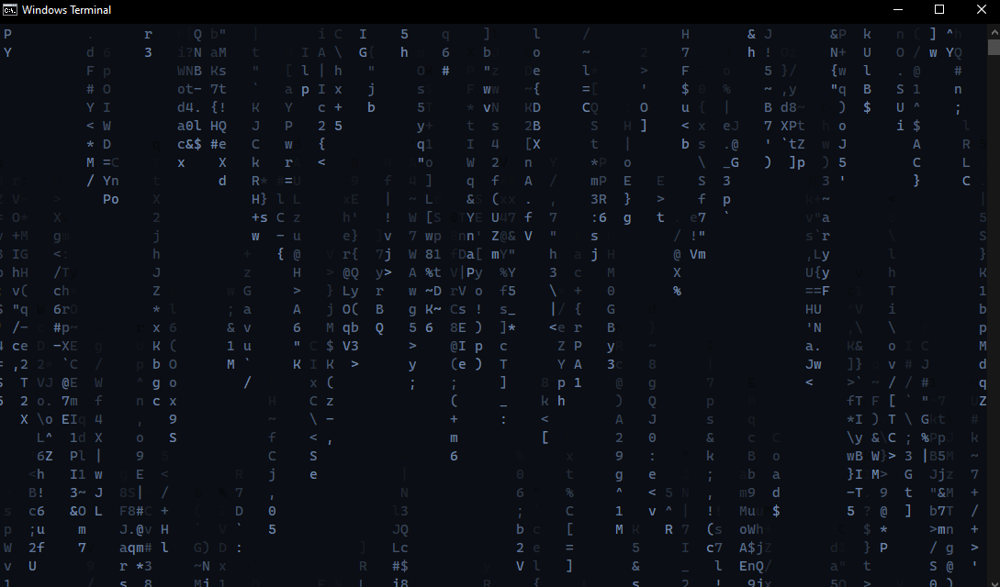

# WinCMatrix

A Windows version of CMatrix written in C from scratch, replicating the famous Matrix digital rain effect.
## Dependencies
- GCC ([MinGW for Windows](https://sourceforge.net/projects/mingw/))
  - Recommendation: Install MinGW through scoop (``scoop install mingw``)
- Make (Optional but recommended, for using Makefile)
  - Included in MinGW Installation
## Usage
### Compiling
#### Using Makefile
```bash
make all
```
#### Using GCC
```bash
gcc -O2 src/main.c -o cmatrix.exe
```
### Using the program
- Format
```bash
cmatrix.exe -delay <value> --textcolor (r,g,b) --stopmidway <true/false> --mintrail <value> --maxtrail <value> --sideway <true/false>
```
- Example
```bash
cmatrix.exe -delay 100 --textcolor (0,255,0) --stopmidway false --mintrail 3 --maxtrail 8 --sideway false
```
| Option| Description|
|-|-|
| `-d <value>`, `--delay <value>`   | Adjusts the speed (lower = faster).     |
| `-c <r,g,b>`, `--textcolor (r,g,b)` | Sets text color using RGB values.     |
| `-s <true/false>`, `--stopmidway <true/false>` | Whether the text stops midway.      |
| `-m <value>`, `--mintrail <value>` | Minimum length of falling trails.      |
| `-M <value>`, `--maxtrail <value>` | Maximum length of falling trails.      |
| `-S <true/false>`, `--sideway <true/false>` | Whether the text goes sideways.     |
| `-C <true/false>`, `--color <true/false>` | Whether to enable color output.      |
| `-h`, `--help`            | Display the help message.               |
## Screenshots


## Credits
[CMatrix](https://github.com/abishekvashok/cmatrix) - Inspiration and the whole reason I made this in the first place
